# Formal Method - COMP313

This is notes of COMP313, Formal Method, which is sorted by lectures.

## Lecture 1: Introduction

- Definition of Formal Methods:  formal methods are a particular kind of **mathematically rigorous** techniques for the specification, development and verification of software and hardware systems
- FM in V-model
- 3 main parts in COMP313:
  - 'Z' notation
  - Temporal Logic
  - Model Checking

## Lecture 2: Propositional Logic

- Two basic logics:
  - Propositional logic
  - First-order Logic
- **Propositional Logic** allows to express complex statements (**formulas**) built from simple statements (**atomic propositions**) by combining simple statements with **logical connectives**
- Atomic propositions:
  - either True or False
  - no part is a proposition
- **Formulas** of propositional logic are constructed from **atomic propositions** by **Boolean logic connectives**.
- Boolean logic connectives:
  - $¬ \phi$ (negation, "not")
  - $\phi \and \psi$ (conjunction, "and")
  - $\phi \or \psi$ (disjunction, "or")
  - $\phi \rightarrow  \psi$ (implication, "if... then ...")
  - $\phi \leftrightarrow \psi$ (biconditional, "if and only if")
- Semantics of Propositional Logic:
  1. Interpretation $I$ is a function mapping atomic propositions to truth values
  2. Semantics of propositional logic is defined as a relation between interpretation $I$ and formula $\varphi$ (check satisfiable between formulas)
- Validity can be checked using truth tables Truth Table:
  
- Valid VS Satisfiable
  - A formula is **valid**, if it is satisfied by **every interpretation** of its atomic propositions
  - A formula is **satisfiable**, if it is satisfied by **some interpretation** of its atomic propositions. "$I$ satisfies $\varphi$ ", denoted by  𝐼 ⊨ 𝜓

-  Two formulas 𝜑 and 𝜓 are **equivalent**, if for **every interpretation 𝐼** of their atomic propositions, **𝐼 ⊨ 𝜑** if and only if **𝐼 ⊨ 𝜓**, denoted by **𝜑 ≡ 𝜓**

## Lecture 3: First-Order Logic

- Limitation of PL: difficult to **quantify over elements of a domain**, e.g "every person is mortal", then, Introduce FoL
- Overview of the Syntax of FoL formulas:
  

- **Atomic Formulas (AF)**: a combination of predefined variables, constants, functions and predicates that can be evaluated to be either Ture or False

- **Formulas** in FOL are constructed from atomic formulas using **Boolean connectives** and **quantifiers**
- Quantifiers: 
  $\varphi$ is a formula, $x$ is a variable, and $\tau$ is a type, denote $\varphi [x/e]$ as  the formula obtained from 𝜑 by replacing 𝑥 by 𝑒
  - $\large \exists x: \tau \bullet (\varphi)$ ("exists"), satisfied, if there is **an element** 𝑒 in 𝜏 such that 𝜑[𝑥/𝑒] is satisfied
  - $\large \forall x: \tau \bullet (\varphi)$ ("for all"), satisfied, if 𝜑[𝑥/𝑒] is satisfied for **every** 𝑒 in 𝜏
- Semantics, with free variables
  - Application: It defines a set of values 𝑒 such that 𝜑[𝑥/𝑒] is satisfied
  - Example: $\large \varphi = \exists y: N \bullet (x = y*y)$ 
                      x is a free variable(without type declaration nor value)
                      Equals to {$\large e \in N | \varphi[x/e]$ evaluates to  T}
                      x is **a set of elements** {0,1,4,9,16,...}
- First-order, since the quantification ranges over elements

## Lecture 4: Sets in Z

- **Set**: an unordered collection of distinct objects

  - does not contain duplicates
  - the order of elements in a set is not significant

- The sets concepts:

  | Name          | Notation          | Description                                                  |
  | ------------- | ----------------- | ------------------------------------------------------------ |
  | subset        | $S \subseteq T$   | if and only if every member of 𝑆 is also in 𝑇                |
  | proper subset | $S \subset T$     | if and only if every member of 𝑆 is also in 𝑇 and **$S \ne T$** |
  | empty set     | $\emptyset$ or {} | a special set that has the property of having no members     |
  | powerset      | $\mathbb{P}$ S    | the powerset of 𝑆 is the set of **all subsets** of 𝑆         |

- Sets manipulations:
  | Name         | Notation   | Description                                                  |
  | ------------ | ---------- | ------------------------------------------------------------ |
  | Union        | $S \cup T$ | a new set that contains the **all** members of both sets     |
  | Intersection | $S \cap T$ | a new set that contains only elements **common** to both     |
  | Difference   | $S $ \ $T$ | the set obtained from S by **removing** all the elements of 𝑇 that occur in S |

- **Cardinality** of a set:  the number of elements in it, NB, could be infinite 

- A set **comprehension** expression:

  - a **signature** – specifies the base sets from which values are extracted

  - a **predicate** – the defining property (constraints) of the set

  - a **term** – specifies how the actual values in the set are computed

    Example:  	{$n: \mathbb{N} | (n\ge 0) \and (n \le 4) \bullet n*2$} 

    Signature:	 $n: \mathbb{N}$

    Predicate:	 $(n\ge 0) \and (n \le 4)$ 

    Term: 			$n*2$

- **Cartesian Product** $A \times B$  denotes the set of **ordered** pairs 𝑎, 𝑏 that 𝑎 ∈ 𝐴 and 𝑏 ∈ 𝐵
  
  NB: $(S_1 \times S_2) \ne (S_2 \times S_1)$ , and $A \times \empty = \empty \times B = \empty$ 

## Lecture 5: Functions in Z

- **Function**:  a relation between two sets $T_1$ and $T_2$ that assigns to
  elements in $T_1$ a single element in $T_2$, that calls many-to-one relations .
- Function Representations: a set of pairs **{($x_1$,$y_1$) , ($x_2$,$y_2$)}** or  Maplet Notation **{$x_1 \mapsto y_1$,  $x_2 \mapsto y_2$}** 
- Notation for Functions
  
  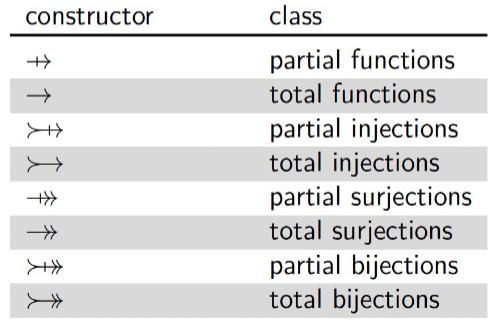
  
- Partial function vs Total function: if is defined for **all potential input values**
- injection vs surjection:  An **“one-to-one”** function is called injection, every possible element in **range space** 

- conclusion 
  

- Function operators:
  - **Domain restriction**
    Notation: $\large S \vartriangleleft f$​ ,  the function obtained from 𝑓, by removing from it all maplets$ 𝑥 ↦ 𝑦$ such that 𝑥 ∉ 𝑆
  - **Range restriction**
    Notation: $\large S \vartriangleright f$ , the function obtained from 𝑓, by removing from it all maplets$ 𝑥 ↦ 𝑦$ such that y ∉ 𝑆
  - **Domain Subtraction**
    Notation: ,  the function obtained from 𝑓, by removing from it all maplets 𝑥 ↦ 𝑦 such that 𝑥 ∈ 𝑆
  - **Domain Subtraction**
    Notation: ,  the function obtained from 𝑓, by removing from it all maplets 𝑥 ↦ 𝑦 such that y ∈ 𝑆
  - **Function Overriding**
    Notation: $ f_1\oplus f_2$ , the function obtained from $f_1$, by replacing from it all maplets 𝑥 ↦ 𝑦 such that 𝑥 in $f_2$ 

## Lecture 6: Schemas in Z

- Z is a model-based specification framework meaning that an **abstract model** of the system with **state space** and **operations**  is described.
- **State Space**:  all the **situations** the system can be in, including functions, sets, relations, bags, sequences, etc. and their invariant properties
- **Operations**:  Specify how to do **transitions** in the defined state-space

- **Schemas**:  the most distinctive feature of the Z specification language, **describe both state spaces and operations**.

​		

- Declarations: Define the **variables** or **functions** used in predicates. Or including  other **schemas**. 

​		

- **operation **schema (modifying, '$\Delta $' or non-modifying,  '$\Xi$' ) :
  - the variables that are **accessed**: **remain unchanged** or **may be altered**
  - the **pre-conditions** of the operation, denote as '?'
  - the **post-conditions** of the operation, denote as '!'

-  **primes** to denote the value of variables **after** applying an operation:
  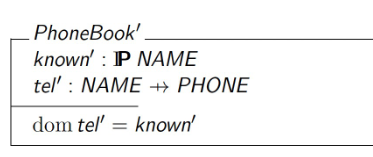

## Lecture 8: Schema Calculus

- **Schema calculus** allows to create new schemas by using **propositional connectives** to combine existing schemas

- Schema **Negation**  $\neg S$ , **negating the predicate part** of 𝑆

- Schema **Type Compatibility**:  every variable common to both has the same type in both

- Binary Connectives $\circ  \in (\and, \or, \to)$  for two type-compatible schemas S and T :
  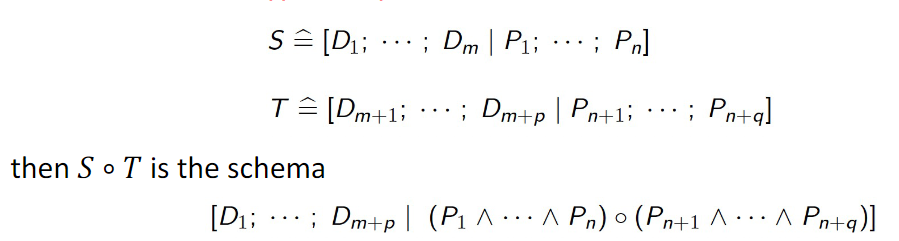

- Benefits of Modularity: more **readable** and concise;  **reusable** in other schemas

## Lecture 9: Bags in Z

- 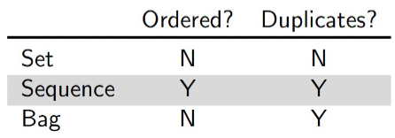

- Bags definition:
  $\large x$ $in$ $B$ , is true iff $x $ appears in $B$ at least once 
  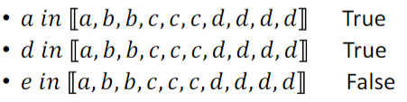

- Sub bags:

  $\large B_1 \sqsubseteq B_2$ , is true iff each element that occurs in $𝐵_1$ occurs no more often than in $B_2$
  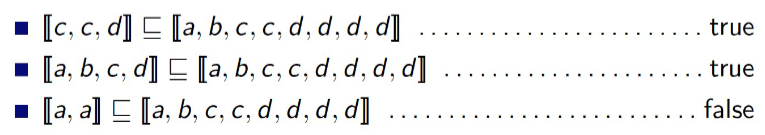

- Counting Bags:

  $\large B \# x$ , returns the number of times $x$ occurs in $B$ 
  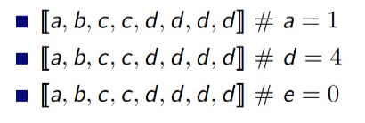

- Scaling Bags:
  $\large n \otimes B$ ,  multiply their contents by n times
  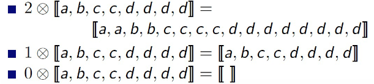

- Bag Union: 
  $\large B_1 \uplus B_2$ , union two bags
  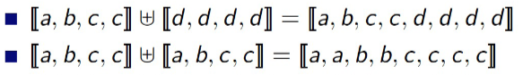

- Bags as Functions:
  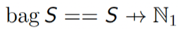

  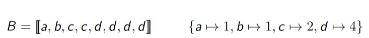

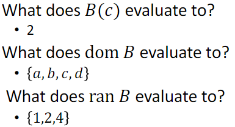

- NOTE: 
  - if $x$ in $B$ is true, then $ B(x) = B\#x$ 
  - if $x$ in $B $is false, then $B\#x = 0$ but $B(x)$ is undefined  

## Lecture 10: Sequence in Z
