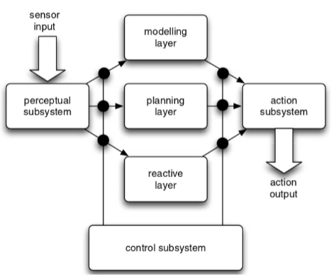
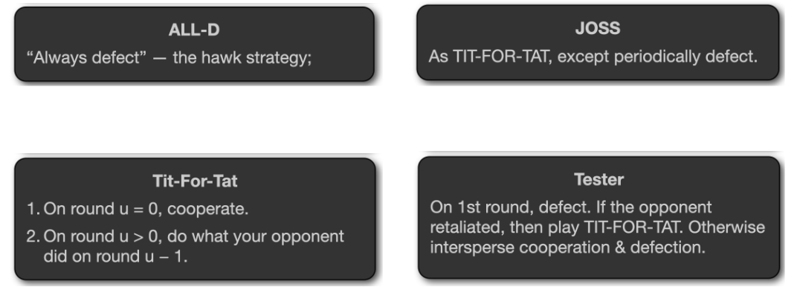
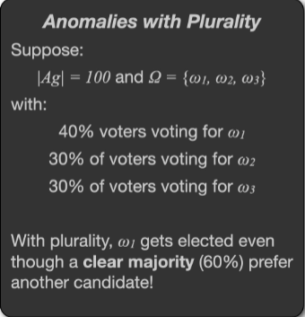
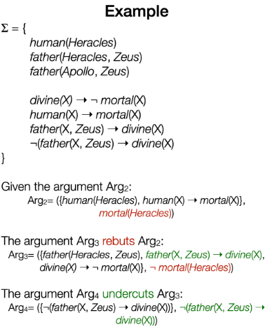

# Multi-agent system - COMP310

Notes for preparing MAS exams.

## Chapter2: Intelligent Agents

- Predicate Task Specifications:  specification that assigns Boolean utilities to agent runs, depending on whether the agent succeeded in its task for a run (i.e. the utility is or if it failed (i.e. the utility is 0). 
- Task Environments: a pair of an environment and a Predicate Task Specification 
- Tasks:
  - achievement tasks: The agent succeeds in an achievement task if it can force the environment into one of the goal states
  - maintenance goal:  the agent succeeds in a maintenance task if it ensures that it is never forced into one of the fail states
- **An agent** is a computer system that is situated in some environment, and that is capable of **autonomous** action in this environment in order to meet its delegated objectives

- Properties of Environments

- Fully observable vs. partially observable
  - **Fully observable**: the agent can obtain complete, accurate, up-to-date information about the environment’s state
  - Most moderately complex environments  are partially observable
- Deterministic vs. non-deterministic
  - **Deterministic**: the environment in which any action has a single guaranteed effect – there is no uncertainty about the state that will result from performing an action
  - Environments **stochastic**: the non-determinism using probability theory
- Static vs. dynamic
  - **Static**: the environment that can be assumed to remain unchanged except by the performance of actions by the agent.
  - A **dynamic** environment is one that has other processes operating on it, and which hence changes in ways beyond the agent’s control

- Discrete vs. continuous
  - **discrete**:  there are a fixed, finite number of actions and precepts in it

- Episodic vs. non-episodic
  - **Episodic**: 
    - 1. Each state is independent of each other.
      1. An agent’s current action will not affect a future action
      1. The performance of an agent is dependent on a number of discrete episodes
      1. agent can decide what action to perform based only on the current episode
  -  **non-episodic** or **sequential**
    - The current decision affects future decisions
- **Real time**: time plays a crucial part in evaluating an agent’s performance

- Intelligent Agents

- exhibiting three types of behaviour:
  - **Reactive** (environment aware): maintains an ongoing interaction
  - **Pro-active** (goal-driven): generating and attempting to achieve goals
  - **Social ability**:  the ability to interact with other agents via **cooperation**, **coordination**, **negotiation**
- Cooperation:  working together as a team to achieve a shared goal
- Coordination:  managing inter-dependencies between the activities of agents
- Negotiation: reach agreements on matters of common interest

- Intentional Systems

- **intentional stance**:  humans use different strategies or stances to explain and predict other entities’ behaviour
  **intentional stance** is **an abstraction tool** 

- **intentional system**: whose behaviour can be predicted by the method of attributing belief, desires and rational acumen

  - A **first-order** intentional system has beliefs and desires (etc.) but no beliefs and desires about beliefs and desires
  - A **second-order** intentional system is more sophisticated; it has beliefs and desires (and no doubt other intentional states) about beliefs and desires (and other intentional states) – both those of others and its own

- To be remembered:

  The intentional stance description is useful when it helps us understand the structure of the machine, its past or future behaviour, or how to repair or improve it. It is useful when it helps us explain and predict a complex system’s behaviour without having to understand how the mechanism actually works.
  The main reason that the intentional stance description is useful is that it is a powerful abstraction tool. It allows us to abstract what is happening at the low level within a machine. So instead of describing knowledge a machine has as data stored within a data-structure, or concerning ourselves with the format, we can simply think of that knowledge as a set of beliefs.

- Formal Agent 

- A system is a **pair** containing **an agent** and **an environment**

- Model an agent as a function which maps runs:  $\large Ag: R_E \to Ac$ 
- runs of agent: $\large R(Ag, Env)$
- **behaviourally equivalent** iff:  $R(Ag_1, Env)$= $R(Ag_2, Env)$
- **purely reactive**: They base their decision making entirely on the present
  $\large Ag: E \to Ac$

- perception function: $\large see: E \to Per$
- action-selection function $action$ : $\large action: I \to Ac$ 
- next state function: $next: I \times Per \to I$ 

- task specification: $u: E \to \mathbb R$

- achievement tasks vs maintenance tasks 
  - **achievement tasks**: specified by a set of “good” or “goal”
  - **maintenance goal** : specified by a set of “bad” states

## Chapter3: Deductive Reasoning Agents
- **Symbolic Reasoning Agents**:  building agents is to view them as a particular type of knowledge-based system, and bring all the associated  methodologies of such systems to bear

- Issues of Symbolic Reasoning Agents: 

  - In general, many (most) research-based symbol manipulation algorithms of interest are **highly intractable**

  - Hard to find compact **representations**

- **Deductive Reasoning Agents** : use logic to encode a theory stating the best action to perform in any given situation

- **Agent-oriented programming**: Directly programming agents in terms of **intentional notions**

- ==(Not in Exam)==An **AGENT0 program** consists of two parts: **initialisation** and **commitment rules**, AGENT0 has 4 components:
  - A set of **capabilities**
  - A set of **initial beliefs**
  - A set of **initial commitments**
  - A set of **commitment rules**, Each commitment rule contains: a **message condition**, a **mental condition**, an **action**
- ==(Not in Exam)== **Her Planning Communicating Agents (PLACA)**  solves The inability of agents to plan, and communicate requests for action via high-level goals for AGENT0.   **Mental states** are expanded to include **plans** and **intentions**

## Chapter4: Practical Reasoning Agents

- **Practical reasoning** is reasoning directed towards **actions** - the process of figuring out what to do

- **Theoretical reasoning** is directed towards **beliefs**

- The Components of Practical Reasoning: 
  - **Deliberation**: Deciding what state of affairs we want to achieve, output **intentions**
  - **Means-ends reasoning**: Deciding how to achieve these states of affairs, output **plans**

- **Practical Reasoning**

  - Intentions:  
    - pose problems for agents  
    - provide a “filter” for adopting other intentions

  - Agents: 
    - track the success of their intentions, and are inclined to try again if their attempts fail
    - believe their intentions are possible
    - do not believe they will not bring about their intentions in **normal case**
    - need not intend all the expected side effects of their intentions

- Example Learning in Chapter 4 p15 -19 , p24-p26

- Formal representation:
  - **A action** $\alpha_i \in Ac$ : $\alpha_i= \langle P_{\alpha_i}, D_{\alpha_i}, A_{\alpha_i}\rangle$ , where  is preconditions, $D_{\alpha_i}$ is delete list, $A_{\alpha_i}$ is add list
  - **A plan** is just a sequence of actions from $Ac$: $\pi = (\alpha_1, ..., \alpha_n)$ 
  -  **A planning problem**: $\langle B_0, Ac, I\rangle$, where $B_0$ is the set of beliefs, $Ac$ is the set of actions, $I$ is the goal(or intention)
  - **A** **plan for a given planning problem**: $B_0 \xrightarrow{\alpha_1} B_1 \xrightarrow{\alpha_2} ... \xrightarrow{\alpha_n} B_n  $ 
  
- **Deliberate function**: 
  - **Option generation**:  generates a set of possible alternatives
    $\large  options: \pmb{\mathscr{P}}(Bel) \times \pmb{\mathscr{P}}(Int) \to \pmb{\mathscr{P}}(Des)$ 
  - **Filtering**: chooses between competing alternatives
    $\large  options: \pmb{\mathscr{P}}(Bel) \times \pmb{\mathscr{P}}(Des)\times \pmb{\mathscr{P}}(Int) \to \pmb{\mathscr{P}}(Int)$ 

- Degrees of Commitment:
  - **Blind commitment**: continue to maintain an intention **until** it believes that the intention has actually been achieved
    ****
    
  - **Single-minded commitment**:  continue to maintain an intention until it believes that **either** the intention has been achieved, **or** else that it is no longer possible to achieve the intention.
    
    $hd(\pi)$ returns the first action in the plan
    
    $tail(\pi)$ returns the last action in the plan
    
    $sound(\pi,I, B)$ means that $\pi$ is a correct plan for $I$ given $B$
    
    
    
  - **Open-minded commitment**: maintain an intention as long as it is still **believed possible**. Example with reconsideration
  
    
  
- An agent has commitment both to:
  - **Ends**: wished state
  - **Means**: the mechanism to wished state

- Intention Reconsideration fn:
  

- Two different types of reconsideration strategy:
  - **Bold** agents: never pause to reconsider intentions before their current plan fully executed
  - **Cautious** agents: stop to reconsider after every action

- **Dynamism**:  the environment is represented by the rate of world change,. $\gamma$ , Bold agents are better when low $\gamma$, cautious agents are better when high $\gamma$ 

## Chapter5: Reactive and Hybrid Agents

### Reactive Systems

-  Agent Control Loop as Layers
  
-  Behaviours:
  -  Complex behaviour emerges from simple components.;
  - layer is independent;
  - Can then assemble them into a complete system
  - 
-  Brooks Behavioural Languages:
  - Situatedness and embodiment
  - Intelligence and emergence
-  Two defining characteristics of **Subsumption Architecture**:
  - An agent’s decision-making process is realised through a set of **task-accomplishing behaviours**
  - Many behaviours can ‘fire’ **simultaneously**.
-  Limitations of Reactive Systems:
  - the need of sufficient information of the local environment for determining actions
  - As actions are based on local information, such agents inherently take a “short-term” view.
  - Emergent behaviour is very hard to engineer or validate
  -  models using many layers are inherently complex and difficult to understand.

### Hybrid Architectures

- **deliberative** Agents, containing a symbolic world model, which develops plans and makes decisions in the way proposed by symbolic AI

- **reactive** Agents, which can react to events without complex reasoning,  they base their decisions on pre-defined rules.

- **Hybrid agents** try to combine the speed of reactive agents with the power of
  deliberative agents Hybrid Architectures:

  - Horizontal layering: 

    - Layers are each directly connected to the sensory input and action output
    - each layer itself acts like an agent, producing suggestions as to what action to perform.

    

  - Vertical layering:

    - Sensory input and action output are each dealt with by at most one layer each

    

- **TouringMachines**:
  - **reactive layer** is implemented as a set of situation-action rules
  - **planning layer** achieves the agent’s proactive behaviour
  - **modelling layer** contains symbolic representations of the
    ‘cognitive state’ of other entities in the agent’s environment

​	

- **InteRRaP**:  a vertically layered two-pass agent architecture
  - Three control layers: behaviour layer, plan layer and cooperation layer
  - Each layer is associated with a knowledge base
  - Bottom-up activation:  a lower layer passes control to a higher layer since it is not competent to deal with the current situation
  - Top-down execution: higher layer makes use of the facilities provided by a lower layer to achieve one of its goals

​	

## Chapter6&7: Ontologies & Communication

- **Speech act theory**: A theory of how utterances are used to achieve intentions
  - Representatives: Such as informing, e.g., ‘It is raining’

  - Directives: Attempts to get the hearer to do something, e.g., ‘please make the tea’

  - Commisives: Which commit the speaker to doing something, e.g., ‘I promise to...’

  - Expressives: Whereby a speaker expresses a mental state, e.g., ‘thank you!’

  - Declarations: Such as declaring war or naming

- **Semantics**: **precondition-delete-add** list formalism of planning research

- **Agent Communication Languages (ACLs)**: standard formats for the exchange of messages
- **Knowledge Sharing Effort (KSE)** 's method: 
  - The message itself: **Knowledge Query and Manipulation Language (KQML)**, that defines various acceptable ‘communicative verbs’, or **performatives**
    
  - The body of the message:  **Knowledge Interchange Format (KIF)**, a language for expressing **message content**, or **domain knowledge**
- The role of an **ontology** is to fix the meaning of the terms used by agents. An **ontology** is a formal definition of a body of knowledge
  
  
  
- Multi-levels of Ontologies:

  - **Upper ontology**: Contains the most general information about the world.

  - **Domain ontology**: Defines concepts appropriate for a specific application domain. For example it might define concepts relating to medical terminology, and be used by a number of applications in the area of medicine. Note that a domain ontology will typically build upon and make use of concepts from an upper ontology; this idea of reuse of ontologies is very important as the more applications use a particular ontology the more agreement there will be on terms.

  - **Application ontology**: Defines concepts used by a specific application. Again, it will typically build upon a domain ontology and in turn upon some upper ontology. Concepts from an application ontology will not usually be reusable; they will typically be of relevance only within the application for which they were defined.

  The more specific an ontology, the less reusable it is.

  

- Aligning Agents’ Ontologies: 
  

- ==(Not in Exam)== Correspondence Inclusion Dialogue (CID): Allows two agents to **exchange knowledge** about **ontological correspondences** to agree upon a **mutually acceptable** final alignment. 
  Assumptions:
  - Each agent knows about different **correspondences** from different **sources**
  - This knowledge is **partial**, and possibly **ambiguous**; i.e., more than one correspondence exists for a given entity
  - Agents associate a utility (**Degree of Belief**) to each **correspondence**

​	

- ==(Not in Exam)== KQML/KIF Example Chapter 6&7 p37

## Chapter8: Multi Agent Coordination 

- Agent Motivations
  - **Benevolent** Agents:  
    - Share the same optimisation target 
    - Problem-solving in benevolent systems is **Cooperative Distributed Problem Solving (CDPS)**
  - Self Interested Agents: 
    - everyone optimise their own interests
    - Strategic behaviour to solve potential conflicts
- **Cooperative Distributed Problem Solving:** studies how a loosely coupled network of problem solvers can work together to solve problems that are beyond their individual capabilities.
- **Coherence**: how well the MA system behaves as a unit along some dimension of evaluation
- **Coordination**: managing inter-dependencies between the activities of agents, coordination relationships between activities could be either positive or negative

- Contract Net:
  - **Recognition**: an agent recognises it has a problem it wants help with
  - **Announcement**: the agent with the task sends out an announcement of the task which includes a specification of the task to be achieved
  - **Bidding**:  Agents that receive the task announcement decide for themselves whether they wish to bid for the task.
  - **Awarding & Expediting**:  communicated to agents that submitted a bid, The successful contractor then expedites the task, May involve another contract net

- Bid decision: 
  - Contractor $i$ receives an announcement of task specification $ts$, which is for a set of tasks $\tau (ts)$ , the cost to $i$ to carry out is $c_i^t(\tau)$
  - The **marginal cost** of carrying out $\tau$ will be:
    $\large \mu_i(\tau(ts)|\tau^t_i)=c_i(\tau(ts)\cup \tau_i^t)-c_i(\tau_i^t)$
  - Contractor $i$'s resource $e_i$ is $\large \mu_i(\tau(ts)|\tau_i^t)< e_i$ means the agent can afford to do the new work 
- Handling Inconsistency:
  - Forbidden, For example, in the contract net the only view that matters is that of the manager agent.
  - Resolve inconsistency, argumentation until resolve
- **Social Norms**: rules of behaviour. Achieved by the **Constraint pairs**: $<E',\alpha>$ , a **social law** is **a set of these constrains**
- **Focal states**: $F \subseteq E$​ are the states we want our agent to be able to get to.  A **useful social law** is then one that does not prevent agents from getting from one focal state to another

- **Joint Persistent Goal (JPG)** :  A group of agents have a collective commitment to bring about some goal $\varphi$ and motivation $\psi$   

## Chapter11: Multi-Agent Competitive

- A **multi-agent system** contains a number of agents that:

  - Interact through communication
  - Are able to act in an environment
  - Have different “spheres of influence”
  - Will be linked by other (organisational) relationships

- Payoff Matrices:

  - Agent $\large i$ is the **column player** and gets the **upper reward** in a cell
  - Agent $\large j $ is the **row player** and gets the **lower reward** in a cell

  

- **Dominant Strategies**: a strategy $s_i$ is **dominant** for agent $i$ if no matter what strategy $s_j$ agent $j$ choose, $i$ will do at least as well playing $s_i$ as it would doing anything else. e.g. the coop is dominates defect for both agents

- A rational agent will never play a dominated strategy

- **Nash Equilibrium (NE)** :  Under the assumption that agent $i$ plays $s_1$ , agent $j$ can do no better than play $s_2$ , either to  agent  $j$ for agent $i$

- Formally: A strategy $(i^*, j^*)$ is a **pure strategy Nash Equilibrium** solution to the game $(A, B)$ if :

  - $\large \forall i, a_{i^*, j^*} \geq a_{i, j^*} $ and $\large \forall j, b_{i^*, j^*} \geq b_{i^*, j} $. This NE may not unique or exist. 

- **mixed strategy**:  allows to choose between possible choices by introducing randomness into the solution. Nash proved that **Every finite game has a Nash Equilibrium in mixed strategies**

- **Pareto optimal** or **Pareto efficient**: there is no other outcome that makes one agent **better off** without making another agent **worse off**. That means, even if I don't directly benefit from outcome $w'$, you can benefit without me suffering

- **social welfare**: the sum of utilities that each agent gets from outcome $w$ : $\large \sum_{i \in Ag}u_i(w)$

- Zero-Sum Interactions: $u_i(w) + u_j(w)=0$, for all $w \in \Omega$ 

- Payoff matrix for prisoner’s dilemma:
  

- Cooperation is (provably) the **rational choice** in the **infinitely repeated** Prisoner’s Dilemma. If finite, raise **backwards induction problem**

- Strategies in Axelrod’s Tournament:
  

## Chapter12: Making Group Decisions

- **social preference order**: $w_a, _iw_c, _iw_d,...,_iw_n$ , where $\Omega = \{w_1,w_2,..\}, |\Omega|=n$ of outcomes for agent $i$  preference

-  Two variants of preference aggregation:

  - **Social welfare functions**: produces a social preference order
    

  - **Social choice function**: get a single choice

- **Plurality**: majority selection

​	

- **Condorcet’s Paradox**: no matter which outcome we choose, a majority of voters will be unhappy with the outcome chosen, solutions: **Sequential Majority Elections**
  
- **Linear Sequential Pairwise Elections**:  reduce a general voting scenario to a series of pairwise voting scenarios of an ordering of the outcomes – the **agenda**

- **majority graph**: An edge $(i, j)$ if $i$ would beat $j$ in a simple majority election,  an odd number of voters of a graph called **tournament**

  - **possible winner** if there is an agenda that will result in it winning overall. In majority graph, a possible winner $w_i$ will have a **path** from $w_i$ to $w_j$ for every other $w_j$ 

  - **Condorcet winner**: if it is the overall winner for every possible agenda.  In majority graph, a possible winner $w_i$ will have a **edge** from $w_i$ to $w_j$ for every other $w_j$

- Slater Ranking: If we reserved some edges in a graph, which ordering minimises this inconsistency measure. For last 2, a **cost** of 1 and 2 are produced. **Slater ranking** is the one with **minimal cost**
  

- **Borda Count**:  takes the whole preference order into account
  

- **social choice voting** or **Instant Runoff Voting**: Counting procedures in rounds, with the last place candidate being eliminated, until there is a majority vote. Offers a solution to Condorcet’s paradox. Example is given in Chapter 12 P31-33.
  
- Desirable Properties of Voting Procedures:
  -  **Pareto property**:  if everybody prefers $w_i$ over $w_j$, then $w_i$ should be ranked over $w_j$ in the social outcome. Satisfied by plurality and Borda but not by sequential majority.
  - **Condorcet Winner condition**: if $w_i$ is a condorcet  winner, the $w_i$ should always be ranked first. However, of the ones we’ve seen, only sequential majority satisfies it
  - **Independence of Irrelevant Alternatives**: the social ranking of $w_i$ and $w_j$ should depend **only** on the way they are ranked in the $\succ$ relations of the voters. Plurality, Borda, and sequential majority do not satisfy IIA.
- A social welfare function $f$ is a **dictatorship** if for some agent $i$: 
  $\large f(\Pi(\Omega_1),\Pi(\Omega_2), \Pi(\Omega_3),...)=\Pi(\Omega_i)$
-  **Arrow’s Theorem**:  For elections with more than 2 candidates, the **only voting procedure satisfying the Pareto condition and IIA is a dictatorship**

- **Gibbard-Satterthwaite Theorem**: **The only non-manipulable voting method** satisfying the Pareto property for elections with more than 2 candidates is a **dictatorship**

## Chapter13: Forming Coalitions

- three stages of cooperative action:

  Coalitional structure generation

  - Solving the optimisation problem of each coalition

  - Dividing the benefits

- A Coalitional Game: $\mathcal{G}=\langle Ag,v\rangle$, where a set of agents: $Ag=\{1,...,n\}$, the characteristic function of the game: $v: 2^{Ag} \rarr \mathbb{R}$ . A coalition $C \subseteq Ag$ 

  - **Singleton Coalition**: a coalition consists of a single member
  - **Grand Coalition**: $C=Ag$ , for all agents 
  - Each coalition has a payoff value $k$, defined by the characteristic function $v(C)=k$

- game property:

  - **superadditive**:  if $v(U) + v(V) \leq v(U\cup V)$, where The coalition that maximises social welfare is the **Grand Coalition**

  - **subadditive**: $v(U) + v(V) \gt v(U\cup V)$, where The coalition that maximises social welfare is the **Singleton Coalition**
  - neither subadditive nor superadditive, The **characteristic function value calculations** need to be determined **for each of the possible coalition**

- **Stability** is a **necessary** but **not** **sufficient** condition for coalitions to form

- the **core** of a coalitional game: the set of **feasible distributions of payoff** to members of a coalition that **no sub-coalition can reasonably object** to. 

- the stability of the grand coalition:

  - An **outcome** $x$ for a coalition $C$ in game $\langle Ag, v\rangle$ is a distribution of $C$ 's utility to members of $C$ , $x=\langle x_1, ..., x_k \rangle$ , which is both **feasible** for $C$ and **efficient**: $v(C) = \sum _{i\in C} x_i$ 
  - **Feasible**: $C$ really could obtain the payoff indicated in the outcome $x$ 
  - **Efficient**: all of the payoff is allocated

- **Shapley value**: the **average** amount that agent $i$ is expected to contribute to a coalition. It is based on the **marginal contribution** of the agent to a coalition: $\delta(C) = v(C \cup {i}) - v(C)$ , where the $\delta(C)$ is the amount of value that agent $i$ adds by joining a coalition $C\subseteq Ag$ 

- A **fair** distribution of coalitional values should satisfy:

  - **symmetry**: Agents that make the same contribution should get the same payoff. **It states**: if $i$ and $j$ are interchangeable, the $\varphi_i = \varphi_j$ 
  - **Dummy player**:  Agents that never have any synergy with any coalition, and thus only get what they can earn on their own. **It states**: if $i$ is a dummy player, then $\varphi_i = v({i})$ 
  - **Additivity**: if two game are combined, the value an agent gets should be the sum of the values it gets in the individual games.  **It states**: the value $\varphi_i^{1+2}$ of agent $i$ in game $\mathcal{G}^{1+2}  $ should be $\varphi_i^{1} + \varphi_i^{2}$

-  marginal contribution can be **dependent** **on the order** in which an agent joins a coalition. It better to consider the average value it adds **over all possible positions that it could enter the coalition**:

  - the **Shapley value** for agent $i$ :

    $\large \varphi_i = \frac{1}{|Ag|!}\sum_{o\in \Pi(Ag)} \delta_i(C_i(o))$ , 
    where $o\in \Pi(Ag)$ denotes the ordering and $C_i(o)$ denotes the agents that appear before agent $i$ 
    

- An n-player game consists of $2^n-1$ coalitions, problem raised in obvious representation, solutions could be:

  - a **complete** representation that is **succinct in “most”** cases

  - a representation that is **not complete** but is **always succinct**

- **Induced Subgraph**: succinct, but not complete

  -  the value of a coalition $C\subseteq Ag$:  $\large v(C) = \sum_{\{i,j\}\subseteq C} w_{i,j}$
  - Shapley value: $\large \varphi_i = \frac{1}{2} \sum_{j \neq i} w_{i,j}$ 
  - 

- **Marginal Contribution Nets**: complete, but not succinct

  - characteristic function $v$ is represented as **a set of rules**: $pattern \to value$ 

  - the value of a coalition $C\subseteq Ag$: $\large v(C) = \sum _{rule_C \in rules} value$ 

    

  - the Shapley value: $\large \varphi_i = \sum _{r_C \in rules} \varphi ^r _i$ 
    

- **Coalition Structure Generation**:  maximise the social welfare of the system
  - The optimal coalition structure:
    						$V(CS) = \sum _{C \in CS} v(C)$, where $CS^*=arg\underset{CS} {max} V(CS)$  

## Chapter 14: Allocating Scarce Resources

- **auction**: takes place between an agent known as the **auctioneer** and a collection of agents known as the **bidders**

- Types of Value:
  - **Private Value**: good has a value to me that is independent of what it is worth to you
  - **Common Value**: good has the same value to all of us, but we have differing estimates of what it is
  - **Correlated Value**: values are related defined
- **winner’s curse**: the winning bid in an auction exceeds the intrinsic value or true worth of an item
- Auction Protocol Dimensions:
  - Winner Determination
  - Open Cry vs. Sealed-bid
  - One-shot vs. Iterated Bids
- Dutch Auction: Starts at a **high price**, and the auctioneer calls out **descending prices**

- Vickrey auction: **second-price sealed-bid** auction. 
  - Each bidder submits a single sealed bid, Bidders do not see the bids made by others; The winning bid is the **highest bid** and pay with **second highest bid** 
  - The payoff of bidder $i$:  $\large p_i = \Bigl\{
    \begin{aligned}
    &v_i - max_{j\neq i}b_j & \text{if } b_i > max_{j \neq i} b_j \\
    &0 & \text{otherwise}
    \end{aligned} \Bigr.$
  - a **dominant strategy** for each bidder to bid their true valuation, making it possible for **antisocial** behavior
- None of the auction types discussed so far are immune to **collusion**:
  - A grand coalition of bidders can agree beforehand to collude
  - An auctioneer could employ bogus bidders
- **Combinatorial Auctions**: auction for bundles of goods
  - valuation function: the value of bundles of goods
  - free disposal: an agent is never worse off having more stuff
  - outcome: an allocation of goods being auctioned among the agents, no need to be allocated
- social welfare function:
  $\large sw(\underset{allocations}{Z_1, ..., Z_n },\underset{valuations}{ v_1, ..., v_n} ) = \sum _{i=1}^n v_i(Z_i)$ 

- Combinatorial auction:
  $\large Z^*_1, ..,Z^*_n=\underset{(Z_1,..,Z_n)\in alloc(\mathcal{Z}, Ag)}{argmax} sw(Z_1,...,Z_n, v_1,...,v_n)$ 
  - where $\mathcal{Z}$ is a set of goods, the goal is to find an allocation $Z_1^*, ..,Z_n^* $ that maximizes $sw$, the collection of valuation functions $v_1,..,v_n$ for each agent $i\in Ag$ 
  - Determining the winner is a **combinatorial optimization problem** (NP-hard)

- An **atomic bid**  $\beta = (Z,p)$, where $p = v_\beta(Z)$ is the price the bidder is prepared to pay for the bundle $Z$, a bundle $Z'$ **satisfies** an atomic bid $(Z,p)$ if $Z\subseteq Z'$ 

- XOR Bids: pay for at most one of the bundles

  $\beta = (Z_1,p_1) XOR...XOR(Z_k,p_k)$
  

- OR Bids: prepared to pay for more than one bundle

  -  $\beta = (Z_1,p_1) OR...OR(Z_k,p_k)$

  - OR bids are strictly less expensive than XOR bids
  - OR bids also suffer from computational complexity
  - 

- VCG Mechanism:

  - **Indifferent valuation** function: $v^0(Z)=0$ for all $Z$ 
  - the **social welfare function without agent $i$** : 
    $\large sw_{-i}(Z_1,...,Z_n, v_1,...,v_n)= \underset{j\in Ag, j\neq i}{\sum} v_j(Z_j)$ , defines  how well everyone expect agent $i$ 
  - the pays $p_i$ for agent $i$ is:
    $\large p_i = sw_{-i}(Z_1,...,Z_n, v_1,..., v^0,...,v_n) $
               $\large - sw_{-i}(Z_1^*,...,Z_n^*, v_1,...,v_i,...,v_n)$

 ## Chapter 15: Bargaining / Negotiation

- **Auctions** are only concerned with the **allocation of goods**;  **Negotiation** is the process of **reaching agreements on matters of common**

- negotiation:

  - **negotiation set**: possible proposals that agents can make
  - **protocol**: defines what legal proposals an agent can make
  - **collection of strategies**: one for each agent, which are typically private
  - **rule**:  determines **when** a deal has been struck and **what** the agreement deal is
  - Negotiation usually proceeds  proceeds in a series of rounds

- **single-issue, symmetric, one-to-one negotiation** settings are in COMP310

- Rubinstein’s alternating offers:

  - 

  - If there is **no agreement**, we say the result is the **conflict deal** $\Theta$ 

- Impatient Players:
  

  

- Negotiation Decision Functions:
  - Boulware: Very **slow initial decrease** in price until close to deadline and then an exponential decrease
  - Conceder: **Makes its concessions early**, and makes fewer concessions later in the negotiation
    

- **Task-Oriented Domains (TODs)**:
  
  - Formally: A TOD is a tuple $\langle T, Ag, c \rangle$ , 
    where, $Ag = \{1,...,n\}$ denotes the participant agents,
    the task set for all possible tasks $T$  
    the cost of each subtasks $c: 2^T \to \mathbb{R}^+$ , is **monotonic** and $c(\empty) = 0$
  - An **encounter** is a collection of tasks $\langle T_1, ..., T_n\rangle$  , where $T_i\subseteq T$ for each agent $i \in Ag$ 
  
- Deals in TODs"
  - deal $\delta = \langle D_1, D_2 \rangle $ for encounter $\langle T_1, T_2 \rangle$  , agent $i$ cost: $c(D_i)$
  - utility of the deal $\delta$ for agent $i$ : $utility_i(\delta) = c(T_i) -c(D_i) $
  - For conflict deal $\Theta $ , $untility_i(\Theta) =0$ , for all agents
  - **dominate deal** $\delta_1 \succ \delta_2$: $ \Bigl\{ \begin{aligned} \forall i\in\{1,2\}, utility_i(\delta_1) \geq utility_i(\delta_2) \\ 
    \exist i\in\{1,2\}, utility_i(\delta_1) > utility_i(\delta_2) \end{aligned}$
  - A deal that is **not dominated** by any other deal is **Pareto optimal**

- **Negotiation Set**: 
  - **Individual rational**: agents won’t be interested in deals that give negative utility since they will prefer the conflict deal
  - **Pareto optimal**: agents can always transform a non-Pareto optimal deal into Pareto optimal deal by making one agent happier and none of the others worse off
    

- Monotonic Concession Protocol: 
  - Negotiation proceeds in rounds $u$ where $u \geq 0 $  
  - On the first round:
    - Both agents **simultaneously** propose a deal from the negotiation set
    - Agreement is reached if one agent finds that the deal proposed by the other is at least as good or better than its proposal
    - If no agreement is reached, then negotiation proceeds to another round of simultaneous proposals
  - In round $u + 1$: 
    - Each agent either **concedes** by making a proposal that is better for the other agent than its previous offer, or wait
    - No agent is allowed to make a proposal that is less preferred by the other agent than the deal it proposed at time $u$ 
  - negotiation is guaranteed to end after a finite number of rounds

- Zeuthen strategy: determine **who** should concede and **how much** in each round, in **Nash Equilibrium**

  - Key idea: evaluate an agent’s **willingness to risk conflict**
  - Agent $i'$s **willingness to risk conflict** at round $t$, denoted $risk_i^t$, can be measured as:
    $\large risk_i^t = \Bigl\{ \begin{aligned} 
    &1 & \text{if }utility_i (\delta_i^t) =0, \\ &\frac{utility_i(\delta_i^t) - utility_i(\Theta)}{utility_i(\delta_i^t)} & otherwise  
    \end{aligned} \Bigr. $
  
  - agent can start by proposing its **most preferred deal**,  Concede whenever its **willingness to risk conflict value** $\leq$ to the other agent's
  - If an agreement is reached, it is guaranteed that this agreement will be **individual rational** and **Pareto optimal**

- Ways to be benefited of Deception in TODs:
  - Phantom and Decoy tasks:  can be prevented by ensuring that tasks are **verifiable**
  - Hidden tasks: 

## Chapter 16: Argumentation

- Argumentation:  principled techniques for resolving with **inconsistencies** with beliefs of multiple agents
- **Dung’s Argumentation System (Abstract argumentation)**: 
  - $q \to p$, means argument $q$ attacks argument $p$ 
  - a set of Dung-style arguments: $\langle \sum, \vartriangleright \rangle$ :
    - $\sum$ : set of arguments
    - $\vartriangleright$ : set of attacks between arguments in $\sum$ 
    - $(\varphi, \psi) \in \vartriangleright$: the relationship: $\varphi$ attacks $\psi$ 
  - Example: $\langle \{p,q,s,r\},\{{\langle r,q \rangle}, {\langle s,q \rangle}, {\langle q,p \rangle}\} \rangle$
    

- **Type of Positions**: 
  - **Position**: $S \subseteq \sum$ denotes a set of arguments
  - **Conflict free positions**: no member of S attacks an other member of S. e.g. $\empty,\{p\},\{q\},\{r\},\{s\}, \{r,s\}, \{p,r\},\{p,s\},\{r,s,p\}$ in previous $\sum$
  - **mutually defensive positions**: every element of S that is attacked is defended by some element of S.
    e.g.  $\empty,\{r\},\{s\}, \{r,s\}, \{p,r\},\{p,s\},\{r,s,p\}$ 
  - **Admissible Positions**: both conflict free and mutually defensive, it is a minimal notion of a reasonable position
  - **Preferred Extension**: a maximal admissible set $S$. if $S$  is admissible and **no superset** of $S$ is admissible . 
    e.g. $\{r,s,q\}$ is a preferred extension, others are not
    
- Argument acceptance:
  - **sceptically** accepted argument: a member of **every preferred extension** 
  - **credulously** accepted argument: a member of **at least one preferred extension**
- Grounded Extensions - a progress:
  - keep $IN$s, that have no attackers
  - eliminate $OUT$, that is attacked by $IN$s 
  - There is **always** a grounded extension, and it is **always unique**
- Full example:
  

- **Deductive Argumentation**,  are defeasible reasoning by logical formulating arguments
  

  - Formally, a **deductive argument** is a pair $(S,p)$ over a database $\sum$ 
  - $\sum$ : a set of logical formulae, the available 'evidence'
  - $p$ : a conclusion, a logical formulae
  - $S $: the grounds or support, a set of logical formulae
    - $S\subseteq \sum$ 
    - $S \vdash p$ 
    - no such $S'$ that $S' \subset S$ and $S' \vdash p$ 

  

  - **Rebut**: $(S_2, p_2)$ rebuts $(S_2, p_1)$  if $p_2\equiv \neg p_1$
  - **Undercut**: $(S_2,p_2)$ undercuts $(S_1, p_1)$ if $p_2 \equiv \neg q_1$ for some $q_1 \in S_1$ 
    

