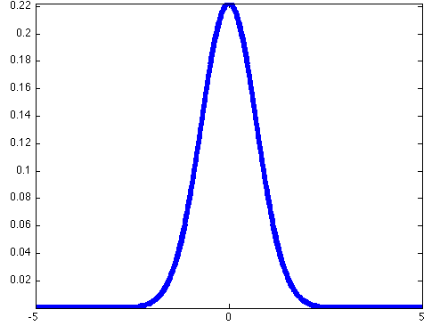

# Neural Networks - ELEC 320 Notes

This is the reviewing notes for ELEC 320: Neural Networks, which will sort by chapters. 

## Chapter 1: Introduction

- **Advantages** of ANNs:
  
  - **Nonlinearity**: neurons can be linear or nonlinear. Many signals are inherently nonlinear
  - **Input-to-output mapping**: sensory inputs are converted to output via a complex distributed function represented by the network
  - **Adaptivity**: NNs can adapt or be re-trained
  - **Evidential response**: during pattern classification, NNs can in addition to the output, provide decision confidence / probability, which is very useful for the rejection of ambiguous patterns
  - **Contextual information**: knowledge is not something separate (file in memory distinct to CPU), but it is represented by the very structure and activation state of the network. Each neuron is affected by all others; local processing and global awareness
  - **Fault tolerance**: when a small damage occurs, the network usually degrades gracefully, as opposed to a fatal catastrophic failure with complete information and processing loss 
  - **Massively parallel structure**: They are suitable for GPUs, TPUs, and VLSI.
  - **Uniformity of analysis and design**: NNs are composed of similar components (neurons), and this makes it easier to apply mathematical techniques to enable learning and network analysis. NNs also allow seamless modular integration
  - **Neurobiological analogy**: NNs can be used to interpret neurobiological behaviour ($\to$). Conversely, borrowing ideas from nature allows the creation of complex learning machines ($\leftarrow$)
  
- Basic structures:
  - Neurons in Brain:
  
    
  
  - Neurons in ANNs:
  
    
  
- Decision boundaries:
  - **Underfitting**: a machine learning model is not complex enough to accurately capture relationships between a dataset’s features and the target variable
  
     
  
  - **Overfitting**: a machine learning model is too closely fit to a limited set of data points and does not generalise well to unseen data points.
    
     

## Chapter 2: Structural aspects

- Mathematical aspects:
  
  - A set of **synapses or connections**: The $j^{th}$ synapse connected to the $k^{th}$ neuron receives signal $x_j$ and multiplies it by $w_{kj}$ 
  - An **adder** for summing: $v_k = \sum w_{kj}z_j + b_k$ with a **bias**: $b_k$ 
  - An **activation function**: $\Phi()$, which is usually nonlinear. 
  
  
  
  - $$
    \Large v_k = \sum _ {j = 1} ^ {m} w_{kj}x_{j} + b_k = W^TX + b_k
    $$
  
  - $$
    \Large y_k =  \Phi(v_k)
    $$
  
- Types of activation functions

  - Threshold or Heaviside function:
    
    $$
    \large \Phi(v) = \left\{
    \begin{aligned} 
    & 1 & \text{if } v\ge 0 \\
    & 0 & \text{if } v < 0
    \end{aligned} 
    \right.
    $$
    
    
  - Piecewise linear function:
    $$
    \Phi(v) =\left\{
    \begin{aligned} 
    & 1 & \text{if } & v\ge \frac{1}{2} \\
    & v+\frac{1}{2} & \text{if } & -\frac{1}{2}< v< \frac{1}{2} \\
    & 0 & \text{if } & v\le -\frac{1}{2} 
    \end{aligned} 
    \right.
    $$
    
    
  - Sigmoid and hyperbolic tangent functions
    $$
    \large \Phi(v) =\left\{
    \begin{aligned} 
    & \frac{1}{1+exp(-\alpha \cdot v)} & \text{Sigmod}\\
    & \frac{exp(2v)-1}{exp(2v)+1} & \text{Tanh} \\
    \end{aligned} 
    \right.
    $$
    
    
  - Rectified linear unit (ReLU)：
  	$$
    \large \Phi(v) = max(v,0)=\left\{
    \begin{aligned} 
    & v & \text{if } & v\ge 0 \\
    & 0 & \text{if } & v < 0
    \end{aligned} 
    \right.
    $$
    
  
- Network architectures：

  -  Single-layer feedforward nets

    $$
    \Large y_k(x) = \phi(\sum _ {j=0} ^p w_{kj}x_j)
    $$
    

  - Multi-layer feedforward nets:
    $$
    \Large y_k(x) = \phi (\sum _ {j=0} ^ {p_{hidden}} \phi(\sum _{i=0} ^{p_{input}} w_{ji} x_i) )
    $$
    

  - Convolutional neural networks:
    

  - Recurrent nets:

    $$
    \Large y_k(n) = y_k(x(n),n) = \phi (\sum _ {i=0} ^ {p_{input}} w_{ki}x_i(n) + \sum _ {j=0} ^ {p_{output}} w_{kj}y_j(n-1) )
    $$
    

- To  measure similarity between two vectors
  $$X_i= [x_{i1},..,x_{ip}]$$ and $$X_j= [x_{j1},..,x_{jp}]$$

  - Euclidean distance:
    $$
    \Large d_{euc}(x_i,x_j) = ||x_i-x_j||_2 = (\sum _{k=1}^p(x_{ik}-x_{jk})^2)^{\frac{1}{2}}
    $$

  -  Inner or dot product
    $$
    \Large d_{euc}^2(x_i,x_j) = (x_i-x_j)^T(x_i-x_j) = 2 - 2X_i^TX_j
    $$
    

  - Mahalanobis distance
    $$
    \Large d_{mah}(x_i,x_j) = \sqrt {\frac{(x_i - \mu)^T} {\sum _ {k=0} ^p E[(x_{jk}-\mu )(x_{jk}-\mu)^T] } }
    $$
    

- Key for a NN:

  - Activation function, e.g. Step, ReLU, sigmoid
  - NN architecture, e.g. MLP, CNN, RNN
  - Error function

## Chapter 3:  Learning processes

- **Primary characteristics of a NN**: learn from its environment, via adapting its structure in order to improve its performance

- Categories of NN algorithms:

  

### Learning rules

- **Error-correction learning**:

  - $e_k(n) = d_k(n) - y_k(n)$ for $k_{th}$ neuron

  - Objective: minimising the cost function $E(n)$, e.g. the squared error $E(n) = \frac {1}{2} e_k^2(n)$ 

  - Weights adjustment: Delta or Widrow-Hoff rule:
    $$
    \large \Delta w_{kj}(n) = \eta \cdot e_k(n)x_j(n)
    $$

    $$
    \large w_{kj}(n+1) = w_{kj}(n)+\Delta w_{kj}(n)
    $$

- **Memory-based learning**:
  
  - Memory set $D_{train}$ to store pairs $(x_i, d_i)$ samples $x_i$ and known desired responses $d_i$: 
  
    $\large D_{train} = \{(x_i,d_i) \}^N_{i=1}$
  
  - Weights adjustment: A new data $x^*$ is added with the closest $x_i$ to it:
  
    $\large d^* =  \underset{x_i \in D_{train}}{argmin}  ||x^*-x_i||_2  $ 
  
  - Extensions of the above include kNN (k-nearest neighbour classifier), weighted nearest neighbour, or Parzen kernels
  
- **Hebbian learning:**

  - uses a **time-dependent**, **highly loca**l and **strongly interactive** mechanism to increase synaptic efficiency, Neurons that fire together wire together.

  - Weights adjustment - activity product rule:
    $$
    \large \Delta w_{kj}(n) = \eta y_k(n)x_j(n)
    $$
    
  - Problem: exponential growth, to solve with:
    $$
    \large \Delta w_{kj}(n) = \eta (y_k-\overline{y})(x_j-\overline{x})
    $$
    
  
- **Competitive learning**:
  
  - only one output neuron can be active, more suitable for classification problems
    
  - Weights adjustment: 
    $$
    \large \Delta w_{ki} = \left\{
    \begin{aligned}
    & \eta(x_i-w_{ki}) & \text{if neuron k wins}  \\
    & 0 & \text{otherwise}
    \end{aligned}
    \right.
    $$
  - Application: Clustering of input patterns
  
- **Boltzmann Learning**:
  
  - NNs with stochastic learning algorithms inspired by statistical mechanics, the energy is:
    $$
    \large E = - \frac{1}{2}\sum_j\sum_{k\ne j} w_{kj}x_kx_j
    $$
    An arbitrary neuron k is chosen at temperature T, and its state $x_k$ is flipped to $–x_k$ with probability:
    $$
    \large p(x_k \to -x_k) = \frac{1}{1+exp(-\frac{\Delta E_k}{T})}
    $$
    The weight is updated as:
    $$
    \large \Delta w_{kj}=\eta(\rho^+_{kj} - \rho^-_{kj}), \forall j \ne k
    $$
    where $\rho^{+/-}_{kj}$ denotes the correlation between the states of the $k^{th}$ and $j^{th}$ neurons with the network in its clamped / free-running condition
    
  
  - The two types of neurons:
  
    - **Visible**: interface between environment and machine
    - **Hidden**: act as freely operating ones.
  
  - The two types of operation modes:
  
    - **Clamped**: visible neurons are all clamped onto specific states
    - **Free-running**: all visible and hidden neurons are operating freely
  
### Learning Paradigms

- **Credit assignment**:

  - assigning **credit or blame for overall outcomes** to each of the **internal decisions** made by the hidden units of a learning algorithm, which contributed to those outcomes

  - Two main subproblems exist:
    - **Temporal**: assignment of credit to actions involving the instants of time when the actions that **deserve credit** were actually taken

    - **Structural**: assignment of credit to **which** internal structures of actions generated by the system and by **how** much. More related to multi-component machine learning

- **Supervised learning**

  - Data from  input-output examples: $D_{train}={(x_i,d_i)}_i^N$

  - the environment is unknown, the network parameters are adjusted based on the combined effect of the error signal and input vector, via an iterative procedure with the **ultimate aim to emulate the teacher**

    

- **Unsupervised learning** 

  - **not** facilitated by a teacher or a critic

  - used **internal representations** to encode the **features and geometrical or statistical properties** of the datasets

    

    

- **Reinforcement learning**

  - train an agent to complete a task within an uncertain environment
  - learning algorithm continuously updates the policy parameters based on the actions, observations, and rewards.
  - Objective: find an optimal policy that maximizes the expected cumulative long-term reward received during the task

  

## Chapter 4: Single layer perceptrons

### **Linear-Least-Squares (LLS)**

-  LLS aims to find the **optimal weights via a single update**, considering all data points simultaneously. 

- The least square error function: 

$$
\large E(w) \equiv(w;n,D) = \frac{1}{2} \sum_{i=1}^{n}e(i)^2 = \frac{1}{2}e(n)^Te(n)= \frac{1}{2}\Vert e(n) \Vert _2 ^2
$$
- the Gauss-Newton method allows the learning algorithm to converge in a single iteration
- The optimal weights is calculate: $w^*(n) = (X^TX)^{-1}X^Td(n)$ 

### Least Mean Square(LMS)

- The cost functions for every single data pair:
  $$
  E(n) = \frac{1}{2}e(n)^2
  $$
  
- the weight could be updated via error:

$$
\large w(n+1) = w(n) - \eta\cdot\frac{\partial E(w)}{\partial w}=w(n) - \eta\cdot e(n)\frac{\partial e(n)}{\partial w} = w(n)+\eta e(n)x(n)
$$
- The output function:
  $$
  \large y_i = \phi(\sum_{i=1}^p w_ix_i + \theta) = \phi(w^Tx)
  $$
  

### Perceptron training algorithm

- **perceptron** used **error-correction learning**, can only fully classify the **linearly separable patterns**

- Linearly separable vs Non-linearly separable:

  **Linearly separable**: if we can find some vector $w$ that satisfies:
  $$
  \left\{
  \begin{aligned}
  &w^Tx>0 & \forall x \in D_1 \\
  &w^Tx\le0 & \forall x \in D_2
  \end{aligned}
  \right\} \text{  where: } D_1\cap D_2 = \empty, D_1 \cup D_2 = D_{train}
  $$
  

  

- Training procedure:

  1. **Initialisation**:  Set $t=1, w(1)=0$ and learning rate $\eta \in (0,1]$ 

  2. **Activation**:  Apply a sample input $x(t)$ to the neuron

  3. **Response**: Compute its response: 
     $$
     y(t) = \phi(w(t)^Tx(t))
     $$
     $$
     \phi(v) = 
     \left\{ 
     \begin{aligned}
     & +1 & v \le 0 \\
     & -1 & v < 0
     \end{aligned}
     \right.
     $$

  4. **Adaptation**: update the current weight vector via (where $d(t)$  denotes the supervised signal to classify $D_{train}$ into $C_1$ and $C_2$):
     $$
     w(t+1) = w(t) + \eta[d(t)-y(t)]x(t)
     $$

     $$
     d(t) = \left\{
     \begin{aligned}
     &+1 & \text{if } x(t) \text{ belongs to }C_1\\
     &-1 & \text{if }  x(t) \text{ belongs to }C_2
     \end{aligned}
     \right.
     $$

  5. **Continuation**: Unless all samples are classified correctly, set $t=t+1$ and go to step 2

-  Perceptron Convergence Theorem: if the dataset is linearly separable, the learning rule will terminate: 
  $$
  \large w(t+1)^Tx(t) = (w(t)^T + 2\eta x(t)^T)x(t)  = w(t)^Tx(t) + 2\eta\cdot\Vert x(t) \Vert ^2_2
  $$
  If $x(t)$ is misclassified, it garantees the correct update direction: 
  
  $$
  \large w(t+1)^Tx(t) \ge w(t)^Tx(t)
  $$
  

## Chapter 5: Multi Layer Perceptron (MLP)

- Architecture of MLP: 
  

- 

## Chapter 6: Radial basis function networks

- **Cover’s Theorem** : A non-linearity separable problem(pattern classification problem) is highly separable in high dimensional space than it is in low dimensional space

- **Radial Basis Functions (RBFs)**:

  - A RBFs NN could be regarded as a function:
    $$
    \large F(x) \equiv \sum_{i=1}^{M} w_i\varphi(\Vert x - c_i \Vert)
    $$
  
   where $\varphi (\Vert x - c_i \Vert)$ is a RBF, $\Vert x-c_i\Vert = \sqrt{(x_1-c_{i1})^2  + ... + (x_d-c_{id})^2}$ denotes the distance between the sample $x$ with dimensions $d$ and centre $c_i$ for each neuron $\in M$
  
  - The error function for size of N dataset:
$$
\large E(w) = \sum_{i=1}^N [F(x_i) - y_i]^2 + \lambda \Vert \mathbb{D}F \Vert^2_2
$$

   where the $\Vert \mathbb{D}F \Vert$ is a The regularisation term employs a linear differential operator $\mathbb{D}$, $\lambda$ is the user defined regularisation parameter

- Commonly used RBFs:

  - Gaussian functions: $\large \varphi(r) = exp(-\frac{r^2}{2\sigma^2}), \sigma >0, r \in \mathcal{R}$

    

  - Inverse multiquadrics: $\large \varphi(r)=\frac{1}{\sqrt{r^2+c^2}}, c>0, r\in \mathcal{R}$ 

    

  - Multiquadrics:  $\large \varphi(r)={\sqrt{r^2+c^2}}, c>0, r\in \mathcal{R}$ 

    

​    

- Set centres and basis widths:
  - **Random selection of fixed centres**: a **random subset** of M<<N of the training set N are served as the **centres**. The **variance** is calculated with the maximum distance $d_{max}$ among the subset: $\large \sigma = \frac{d_{max}}{\sqrt{2M}} $ 
  - **Self organised centre selection**: data samples. We use a **clustering algorithm** (e.g. K means) to group the data points into distinct groups.
  - **Supervised centre selection**: : Optimises all three types of parameters (centres, widths and weights) simultaneously
    

- RBFs vs MLPs

    |                        |      RBFs       |     MLPs      |
    | :--------------------: | :-------------: | :-----------: |
    |        Mapping         |    Nonlinear    |   Nonlinear   |
    | Function approximator  |    Universal    |   Universal   |
    |     Hidden layers      |     single      | may have many |
    | hidden activation base | distance+centre | inner product |
    |     approximation      |      local      |    global     |
    

## Chapter 7: Support vector machines

- margin of separation $\rho_0 $ denotes the distance between the discission plan and the nearest point in dataset $D$  

- The principal aim of SVM is to find the **optimal hyperplane** defined as $(w_0,b_0)$ and by $g(x)=0$ which maximises the margin of separation $\rho_0$ 
  $$
  g(x) = w_0^T x + b_0
  $$
  

- Assume a point $x$ in this space could be expressed with some point $x_p$  on the optimal plane and the distance $r$ to the optimal plane:
  $$
  \large x= x_p + r\frac{w_0}{\Vert w_0 \Vert_2}
  $$
  

​	 the output of function $g(x)$ with this point $x$ could be:
$$
\large g(x) = w_0^T(x_p +r\frac{w_0}{\Vert w_0 \Vert_2}) +b_0 = w_o^Tx_p + b_0 + r\frac{w_0^Tw_0}{\Vert w_0 \Vert _2} = r\Vert w_0 \Vert _2
$$
​	Therefore the distance could be expressed as: $\large r = \frac{g(x)}{\Vert w_0 \Vert _2}$ 

- **Support vectors** are the points $x_i \in D$ that meets $w_o^T+b = d_i$ , where $d_i \in [-1,1]$ denotes the labels
  

- The primal problem is to maximise the margin $\large \rho = \frac{2}{\Vert w_0 \Vert} $ :
   $$
   \large \left\{ \begin{aligned} &\text{min  }\frac{1}{2}w^Tw \\ &d_i(w^Tx_i+b)\ge 1,  \forall i \in \{1,...,N\} \end{aligned}  \right .
   $$
  therefore we could write in Lagrangian function: 
  $$
  \large L(b,w,\lambda)= \frac{1}{2} w^Tw + \sum_{i=1}^{N}\lambda_i[1-d_i(w^Tx_i+b)]
  $$
  aims to get
   $\large g(\lambda) = \underset{b,w}{\text{min }L(b.w,\lambda) } $ 

- slack variables to relax the constraints $\xi$ 
  $\large d_i(w^Tx+b)\ge 1-\xi_i$

  The optimization problem becomes with $\xi \ge 0$:

  $$
  \large \left\{ \begin{aligned} &\text{min  }\frac{1}{2}w^Tw + C\sum_{i=1}^N \xi_i \\ &d_i(w^Tx_i+b)\ge 1 - \xi_i,  \forall i \in \{1,...,N\} \end{aligned}  \right .
  $$
  

- 

