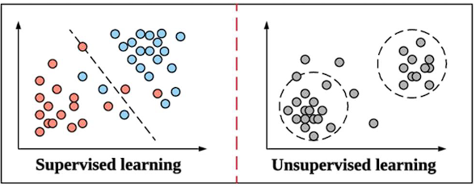

# Neural Networks - ELEC 320 Notes

This is the reviewing notes for ELEC 320: Neural Networks, which will sort by chapters. 

## Chapter 1: Introduction

- **Advantages** of ANNs:
  
  - **Nonlinearity**: neurons can be linear or nonlinear. Many signals are inherently nonlinear
  - **Input-to-output mapping**: sensory inputs are converted to output via a complex distributed function represented by the network
  - **Adaptivity**: NNs can adapt or be re-trained
  - **Evidential response**: during pattern classification, NNs can in addition to the output, provide decision confidence / probability, which is very useful for the rejection of ambiguous patterns
  - **Contextual information**: knowledge is not something separate (file in memory distinct to CPU), but it is represented by the very structure and activation state of the network. Each neuron is affected by all others; local processing and global awareness
  - **Fault tolerance**: when a small damage occurs, the network usually degrades gracefully, as opposed to a fatal catastrophic failure with complete information and processing loss 
  - **Massively parallel structure**: They are suitable for GPUs, TPUs, and VLSI.
  - **Uniformity of analysis and design**: NNs are composed of similar components (neurons), and this makes it easier to apply mathematical techniques to enable learning and network analysis. NNs also allow seamless modular integration
  - **Neurobiological analogy**: NNs can be used to interpret neurobiological behaviour ($\to$). Conversely, borrowing ideas from nature allows the creation of complex learning machines ($\leftarrow$)
  
- Basic structures:
  - Neurons in Brain:
  
    
  
  - Neurons in ANNs:
  
    
  
- Decision boundaries:
  - **Underfitting**: a machine learning model is not complex enough to accurately capture relationships between a dataset’s features and the target variable
  
     
  
  - **Overfitting**: a machine learning model is too closely fit to a limited set of data points and does not generalise well to unseen data points.
    
     

## Chapter 2: Structural aspects

- Mathematical aspects:
  
  - A set of **synapses or connections**: The $j^{th}$ synapse connected to the $k^{th}$ neuron receives signal $x_j$ and multiplies it by $w_{kj}$ 
  - An **adder** for summing: $v_k = \sum w_{kj}z_j + b_k$ with a **bias**: $b_k$ 
  - An **activation function**: $\Phi()$, which is usually nonlinear. 
  
  
  
  - $$
    \Large v_k = \sum _ {j = 1} ^ {m} w_{kj}x_{j} + b_k = W^TX + b_k
    $$
  
  - $$
    \Large y_k =  \Phi(v_k)
    $$
  
- Types of activation functions

  - Threshold or Heaviside function:
    
    $$
    \large \Phi(v) = \left\{
    \begin{aligned} 
    & 1 & \text{if } v\ge 0 \\
    & 0 & \text{if } v < 0
    \end{aligned} 
    \right.
    $$
    
    
  - Piecewise linear function:
    $$
    \Phi(v) =\left\{
    \begin{aligned} 
    & 1 & \text{if } & v\ge \frac{1}{2} \\
    & v+\frac{1}{2} & \text{if } & -\frac{1}{2}< v< \frac{1}{2} \\
    & 0 & \text{if } & v\le -\frac{1}{2} 
    \end{aligned} 
    \right.
    $$
    
    
  - Sigmoid and hyperbolic tangent functions
    $$
    \large \Phi(v) =\left\{
    \begin{aligned} 
    & \frac{1}{1+exp(-\alpha \cdot v)} & \text{Sigmod}\\
    & \frac{exp(2v)-1}{exp(2v)+1} & \text{Tanh} \\
    \end{aligned} 
    \right.
    $$
    
    
  - Rectified linear unit (ReLU)：
  	$$
    \large \Phi(v) = max(v,0)=\left\{
    \begin{aligned} 
    & v & \text{if } & v\ge 0 \\
    & 0 & \text{if } & v < 0
    \end{aligned} 
    \right.
    $$
    
  
- Network architectures：

  -  Single-layer feedforward nets

    $$
    \Large y_k(x) = \phi(\sum _ {j=0} ^p w_{kj}x_j)
    $$
    

  - Multi-layer feedforward nets:
    $$
    \Large y_k(x) = \phi (\sum _ {j=0} ^ {p_{hidden}} \phi(\sum _{i=0} ^{p_{input}} w_{ji} x_i) )
    $$
    

  - Convolutional neural networks:
    

  - Recurrent nets:

    $$
    \Large y_k(n) = y_k(x(n),n) = \phi (\sum _ {i=0} ^ {p_{input}} w_{ki}x_i(n) + \sum _ {j=0} ^ {p_{output}} w_{kj}y_j(n-1) )
    $$
    

- To  measure similarity between two vectors
  $$X_i= [x_{i1},..,x_{ip}]$$ and $$X_j= [x_{j1},..,x_{jp}]$$

  - Euclidean distance:
    $$
    \Large d_{euc}(x_i,x_j) = ||x_i-x_j||_2 = (\sum _{k=1}^p(x_{ik}-x_{jk})^2)^{\frac{1}{2}}
    $$

  -  Inner or dot product
    $$
    \Large d_{euc}^2(x_i,x_j) = (x_i-x_j)^T(x_i-x_j) = 2 - 2X_i^TX_j
    $$
    

  - Mahalanobis distance
    $$
    \Large d_{mah}(x_i,x_j) = \sqrt {\frac{(x_i - \mu)^T} {\sum _ {k=0} ^p E[(x_{jk}-\mu )(x_{jk}-\mu)^T] } }
    $$
    

- Key for a NN:

  - Activation function, e.g. Step, ReLU, sigmoid
  - NN architecture, e.g. MLP, CNN, RNN
  - Error function

## Chapter 3:  Learning processes

- **Primary characteristics of a NN**: learn from its environment, via adapting its structure in order to improve its performance

- Categories of NN algorithms:

  

### Learning rules

- **Error-correction learning**:

  - $e_k(n) = d_k(n) - y_k(n)$ for $k_{th}$ neuron

  - Objective: minimising the cost function $E(n)$, e.g. the squared error $E(n) = \frac {1}{2} e_k^2(n)$ 

  - Weights adjustment: Delta or Widrow-Hoff rule:
    $$
    \large \Delta w_{kj}(n) = \eta \cdot e_k(n)x_j(n)
    $$

    $$
    \large w_{kj}(n+1) = w_{kj}(n)+\Delta w_{kj}(n)
    $$

- **Memory-based learning**:
  
  - Memory set $D_{train}$ to store pairs $(x_i, d_i)$ samples $x_i$ and known desired responses $d_i$: 
  
    $\large D_{train} = \{(x_i,d_i) \}^N_{i=1}$
  
  - Weights adjustment: A new data $x^*$ is added with the closest $x_i$ to it:
  
    $\large d^* =  \underset{x_i \in D_{train}}{argmin}  ||x^*-x_i||_2  $ 
  
  - Extensions of the above include kNN (k-nearest neighbour classifier), weighted nearest neighbour, or Parzen kernels
  
- **Hebbian learning:**

  - uses a **time-dependent**, **highly loca**l and **strongly interactive** mechanism to increase synaptic efficiency, Neurons that fire together wire together.

  - Weights adjustment - activity product rule:
    $$
    \large \Delta w_{kj}(n) = \eta y_k(n)x_j(n)
    $$
    
  - Problem: exponential growth, to solve with:
    $$
    \large \Delta w_{kj}(n) = \eta (y_k-\overline{y})(x_j-\overline{x})
    $$
    
  
- **Competitive learning**:
  
  - only one output neuron can be active, more suitable for classification problems
    
  - Weights adjustment: 
    $$
    \large \Delta w_{ki} = \left\{
    \begin{aligned}
    & \eta(x_i-w_{ki}) & \text{if neuron k wins}  \\
    & 0 & \text{otherwise}
    \end{aligned}
    \right.
    $$
  - Application: Clustering of input patterns
  
- **Boltzmann Learning**:
  
  - NNs with stochastic learning algorithms inspired by statistical mechanics, the energy is:
    $$
    \large E = - \frac{1}{2}\sum_j\sum_{k\ne j} w_{kj}x_kx_j
    $$
    An arbitrary neuron k is chosen at temperature T, and its state $x_k$ is flipped to $–x_k$ with probability:
    $$
    \large p(x_k \to -x_k) = \frac{1}{1+exp(-\frac{\Delta E_k}{T})}
    $$
    The weight is updated as:
    $$
    \large \Delta w_{kj}=\eta(\rho^+_{kj} - \rho^-_{kj}), \forall j \ne k
    $$
    where $\rho^{+/-}_{kj}$ denotes the correlation between the states of the $k^{th}$ and $j^{th}$ neurons with the network in its clamped / free-running condition
    
  
  - The two types of neurons:
  
    - **Visible**: interface between environment and machine
    - **Hidden**: act as freely operating ones.
  
  - The two types of operation modes:
  
    - **Clamped**: visible neurons are all clamped onto specific states
    - **Free-running**: all visible and hidden neurons are operating freely
  
### Learning Paradigms

- **Credit assignment**:

  - assigning **credit or blame for overall outcomes** to each of the **internal decisions** made by the hidden units of a learning algorithm, which contributed to those outcomes

  - Two main subproblems exist:
    - **Temporal**: assignment of credit to actions involving the instants of time when the actions that **deserve credit** were actually taken

    - **Structural**: assignment of credit to **which** internal structures of actions generated by the system and by **how** much. More related to multi-component machine learning

- **Supervised learning**

  - Data from  input-output examples: $D_{train}={(x_i,d_i)}_i^N$

  - the environment is unknown, the network parameters are adjusted based on the combined effect of the error signal and input vector, via an iterative procedure with the **ultimate aim to emulate the teacher**

    

- **Unsupervised learning** 

  - **not** facilitated by a teacher or a critic

  - used **internal representations** to encode the **features and geometrical or statistical properties** of the datasets

    

    

- **Reinforcement learning**

  - train an agent to complete a task within an uncertain environment
  - learning algorithm continuously updates the policy parameters based on the actions, observations, and rewards.
  - Objective: find an optimal policy that maximizes the expected cumulative long-term reward received during the task

  

## Chapter 4: Single layer perceptrons

